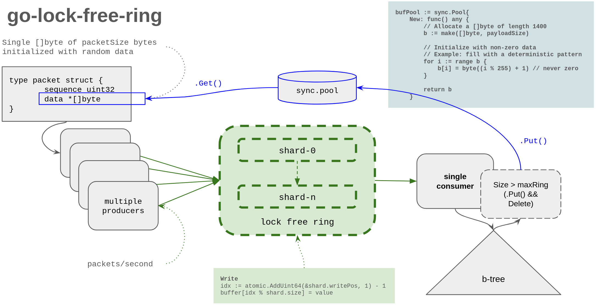

# go-lock-free-ring

A high-performance, lock-free, sharded MPSC (Multi-Producer, Single-Consumer) ring buffer library written in Go.

**Key Features:**
- Lock-free design using atomic operations (no mutexes)
- Sharded architecture to minimize producer contention
- Zero-allocation steady-state with `sync.Pool` integration
- Tested up to 400 Mb/s sustained throughput
- Comprehensive benchmarks and profiling



## Quick Start

### Installation

```bash
go get github.com/randomizedcoder/go-lock-free-ring
```

### Basic Usage

```go
package main

import (
    "fmt"
    ring "github.com/randomizedcoder/go-lock-free-ring"
)

func main() {
    // Create a ring with 1024 total capacity across 4 shards
    r, err := ring.NewShardedRing(1024, 4)
    if err != nil {
        panic(err)
    }

    // Producer writes (can be called from multiple goroutines)
    producerID := uint64(0)
    if r.Write(producerID, "hello") {
        fmt.Println("Write successful")
    }

    // Consumer reads (single goroutine)
    if value, ok := r.TryRead(); ok {
        fmt.Printf("Read: %v\n", value)
    }

    // Batch read for efficiency
    items := r.ReadBatch(100)
    fmt.Printf("Read %d items\n", len(items))
}
```

### Run the Example

```bash
# Clone and build
git clone https://github.com/randomizedcoder/go-lock-free-ring.git
cd go-lock-free-ring

# Run example with 4 producers at 10 Mb/s for 5 seconds
make run-cmd

# Run with custom configuration
make run-cmd-custom ARGS="-producers=8 -rate=50 -duration=10s"

# Run tests
make test

# Run benchmarks
make bench

# Run performance profiling (400 Mb/s test)
make test-integration-profile-400mbps
```

### Performance at a Glance

| Configuration | Throughput | Memory | Allocations | Ring Contention |
|--------------|------------|--------|-------------|-----------------|
| 4×50 Mb/s | 200 Mb/s | 3.49 MB | 4 objects | 0% |
| 8×50 Mb/s | 400 Mb/s | 2.29 MB | 7 objects | 0% |

See [Performance Testing](#performance-testing) for detailed profiling results.

---

## Background

Lock-free data structures use atomic operations instead of mutexes to achieve thread safety. This eliminates lock contention and provides more predictable latency, making them ideal for high-performance systems like network packet processing, logging pipelines, and message queues.

For an excellent introduction to lock-free programming, see Herb Sutter's CppCon talk: [Lock-Free Programming (or, Juggling Razor Blades)](https://youtu.be/c1gO9aB9nbs).

---

## Ring Library Design

This section describes the detailed implementation of the `ring.go` lock-free ring buffer library.

### Architecture Overview

The library implements a **Sharded Lock-Free MPSC (Multi-Producer, Single-Consumer) Ring Buffer**. The design partitions a single large ring buffer into multiple independent shards, where each shard is itself a lock-free circular buffer. This approach dramatically reduces write contention among producers while maintaining simplicity for the single consumer.

```
┌─────────────────────────────────────────────────────────────────┐
│                      ShardedRing                                │
│  ┌─────────┐  ┌─────────┐  ┌─────────┐       ┌─────────┐       │
│  │ Shard 0 │  │ Shard 1 │  │ Shard 2 │  ...  │ Shard N │       │
│  │ ┌─────┐ │  │ ┌─────┐ │  │ ┌─────┐ │       │ ┌─────┐ │       │
│  │ │ buf │ │  │ │ buf │ │  │ │ buf │ │       │ │ buf │ │       │
│  │ │ [0] │ │  │ │ [0] │ │  │ │ [0] │ │       │ │ [0] │ │       │
│  │ │ [1] │ │  │ │ [1] │ │  │ │ [1] │ │       │ │ [1] │ │       │
│  │ │ ... │ │  │ │ ... │ │  │ │ ... │ │       │ │ ... │ │       │
│  │ │ [n] │ │  │ │ [n] │ │  │ │ [n] │ │       │ │ [n] │ │       │
│  │ └─────┘ │  │ └─────┘ │  │ └─────┘ │       │ └─────┘ │       │
│  │writePos │  │writePos │  │writePos │       │writePos │       │
│  │readPos  │  │readPos  │  │readPos  │       │readPos  │       │
│  └─────────┘  └─────────┘  └─────────┘       └─────────┘       │
└─────────────────────────────────────────────────────────────────┘
        ▲               ▲               ▲               ▲
        │               │               │               │
   Producer 0      Producer 1      Producer 2      Producer N
   (hash → 0)      (hash → 1)      (hash → 2)      (hash → N)

                              │
                              ▼
                    ┌─────────────────┐
                    │  Single Reader  │
                    │  (polls all     │
                    │   shards)       │
                    └─────────────────┘
```

### Data Structures

#### Slot Structure

Each slot holds a value with a sequence number for race-free concurrent access:

```go
type slot struct {
    seq   uint64  // Sequence number - signals when data is ready
    value any     // The stored value
}
```

The sequence number enables lock-free synchronization:
- **Initial state**: `seq = slotIndex` (slot is available for writing at position `slotIndex`)
- **After write**: `seq = writePos + 1` (signals data is ready for reading)
- **After read**: `seq = readPos + size` (marks slot available for next write cycle)

#### Shard Structure

Each shard is an independent lock-free ring buffer:

```go
type Shard struct {
    buffer   []slot   // circular buffer with per-slot sequence numbers
    size     uint64   // capacity of this shard
    writePos uint64   // atomic: next position to claim for writing
    readPos  uint64   // atomic: next position to read from
    //_        [40]byte // cache line padding to prevent false sharing
}
```

**Cache Line Padding**: The padding field helps prevent false sharing between shards. The optimal padding size depends on:

1. **Cache line size**: Typically 64 bytes on modern x86/ARM CPUs
2. **Struct layout**: The Shard fields before padding total 48 bytes:
   - `buffer []slot` = 24 bytes (slice header: pointer + len + cap)
   - `size uint64` = 8 bytes
   - `writePos uint64` = 8 bytes
   - `readPos uint64` = 8 bytes
3. **Allocation pattern**: Since `[]*Shard` uses pointers, each shard is heap-allocated separately

**Determining optimal padding**: Run `go test -bench=ShardPadding` to benchmark different sizes. The current 40-byte padding results in 88-byte total struct size. Benchmarks show performance is relatively stable across padding sizes (0-56 bytes) because heap allocation naturally spreads shards across cache lines.

#### ShardedRing Structure

The main ring structure manages multiple shards:

```go
type ShardedRing struct {
    shards    []*Shard  // array of shard pointers
    numShards uint64    // number of shards (power of 2 recommended)
    mask      uint64    // numShards - 1, for fast modulo via bitwise AND
}
```

### API Design

#### Constructor

```go
func NewShardedRing(totalCapacity uint64, numShards uint64) *ShardedRing
```

- `totalCapacity`: Total number of items the ring can hold across all shards
- `numShards`: Number of shards to partition the ring into (must be power of 2)
- Each shard capacity = `totalCapacity / numShards`

#### Producer Interface

**Non-blocking write (immediate return):**

```go
func (r *ShardedRing) Write(producerID uint64, value any) bool
```

- `producerID`: Unique identifier for the producer (used for shard selection)
- `value`: The data to write into the ring
- Returns `true` on success, `false` if the selected shard is full

**Write with configurable backoff:**

```go
func (r *ShardedRing) WriteWithBackoff(producerID uint64, value any, config WriteConfig) bool
```

When the ring is full, this method retries with backoff instead of immediately returning false:

```go
type WriteConfig struct {
    MaxRetries      int           // Attempts before sleeping (default: 10)
    BackoffDuration time.Duration // Sleep duration after retries (default: 100µs)
    MaxBackoffs     int           // Max backoff cycles, 0 = unlimited (default: 0)
}

// Example usage:
config := ring.WriteConfig{
    MaxRetries:      10,                    // Try 10 times before sleeping
    BackoffDuration: 100 * time.Microsecond, // Sleep 100µs between batches
    MaxBackoffs:     1000,                  // Give up after 1000 cycles
}
if !ring.WriteWithBackoff(producerID, value, config) {
    // Ring persistently full - handle backpressure
}
```

This reduces CPU spinning when producers outpace the consumer, trading latency for efficiency.

#### Consumer Interface

```go
func (r *ShardedRing) TryRead() (any, bool)
```

- Attempts to read one item from any shard
- Returns the value and `true` if an item was read
- Returns `nil` and `false` if all shards are empty

```go
func (r *ShardedRing) ReadBatch(maxItems int) []any
```

- Reads up to `maxItems` from all shards in a round-robin fashion
- Returns a slice of items read (may be empty if ring is empty)
- More efficient for batch processing scenarios

### Implementation Details

#### Per-Slot Sequence Numbers (Race-Free Design)

The implementation uses per-slot sequence numbers to ensure race-free operation without global serialization. This design is inspired by the LMAX Disruptor pattern.

**Why per-slot sequences?** A naive implementation might use a global "committed" counter, but this creates a serialization bottleneck where producers must commit in order. Per-slot sequences allow independent commits:

| Approach | Concurrent Write Performance |
|----------|------------------------------|
| Global committed counter | 11,000,000+ ns/op (500,000x slower!) |
| Per-slot sequence | 24 ns/op ✓ |

#### Write Operation (Lock-Free)

```go
func (s *Shard) write(value any) bool {
    // Atomically claim the next write slot
    pos := atomic.AddUint64(&s.writePos, 1) - 1
    idx := pos % s.size
    sl := &s.buffer[idx]

    // Check if slot is available (seq == pos means slot is free)
    seq := atomic.LoadUint64(&sl.seq)
    if seq != pos {
        // Slot not available - ring is full
        atomic.AddUint64(&s.writePos, ^uint64(0)) // unclaim
        return false
    }

    // Write the value
    sl.value = value

    // Signal data is ready (seq = pos+1)
    atomic.StoreUint64(&sl.seq, pos+1)

    return true
}
```

**Key Points**:
- `atomic.AddUint64` claims a unique position for each producer
- Slot availability is checked via sequence number, not global counter
- Each producer can commit independently (no waiting for others)
- The sequence update signals to the consumer that data is ready

#### Read Operation (Single Consumer)

```go
func (s *Shard) tryRead() (any, bool) {
    readPos := atomic.LoadUint64(&s.readPos)
    idx := readPos % s.size
    sl := &s.buffer[idx]

    // Check if data is ready (seq should be readPos+1)
    seq := atomic.LoadUint64(&sl.seq)
    if seq != readPos+1 {
        return nil, false // Not ready
    }

    // Read and clear value
    value := sl.value
    sl.value = nil

    // Mark slot available for next write cycle (seq = readPos+size)
    atomic.StoreUint64(&sl.seq, readPos+s.size)

    // Advance read position
    atomic.StoreUint64(&s.readPos, readPos+1)

    return value, true
}
```

**Key Points**:
- Sequence check ensures data is fully written before reading
- Clearing `sl.value = nil` helps the garbage collector
- Setting `seq = readPos + size` marks the slot available for the next write at that position
- All operations on shared state use atomics for race-free access

#### Shard Selection

Producers are distributed across shards using a hash function:

```go
func (r *ShardedRing) selectShard(producerID uint64) *Shard {
    // Fast modulo for power-of-2 shard counts
    shardIdx := producerID & r.mask
    return r.shards[shardIdx]
}
```

Alternative selection strategies:
- **Round-robin per producer**: Each producer maintains its own counter and cycles through shards
- **Random selection**: `rand.Uint64() & r.mask` for load balancing
- **Thread affinity**: Use goroutine ID (if available) for cache locality

#### Consumer Polling Loop

The consumer iterates through all shards to collect available data:

```go
func (r *ShardedRing) ReadBatch(maxItems int) []any {
    result := make([]any, 0, maxItems)

    // Round-robin through all shards
    for i := uint64(0); i < r.numShards && len(result) < maxItems; i++ {
        shard := r.shards[i]
        for len(result) < maxItems {
            if val, ok := shard.TryRead(); ok {
                result = append(result, val)
            } else {
                break // this shard is empty
            }
        }
    }

    return result
}
```

### Memory Management Integration

The ring library is designed to work with `sync.Pool` for efficient memory reuse:

#### Producer Side

```go
// Get buffer from pool
buf := bufPool.Get().([]byte)

// Create packet with pooled buffer
pkt := &packet{
    sequence: nextSeq,
    data:     &buf,
}

// Write to ring
ring.Write(producerID, pkt)
```

#### Consumer Side

```go
// Read from ring
items := ring.ReadBatch(1000)

for _, item := range items {
    pkt := item.(*packet)

    // Process packet...

    // Return buffer to pool when done
    bufPool.Put(*pkt.data)
}
```

### Synchronization Strategy Summary

| Operation | Synchronization | Reason |
|-----------|-----------------|--------|
| Write (claim slot) | `atomic.AddUint64` | Multiple producers compete for slots |
| Write (store value) | None | Each producer writes to its own claimed slot |
| Read (check availability) | `atomic.LoadUint64` on writePos | See latest producer progress |
| Read (load value) | None | Single consumer, no competition |
| Read (advance readPos) | None | Single consumer owns readPos |

### Design Trade-offs

#### Advantages

1. **Lock-Free**: No mutex contention, predictable latency
2. **Sharded**: Reduces CAS contention among producers proportionally to shard count
3. **Cache-Friendly**: Padding prevents false sharing between shards
4. **Simple Consumer**: Single-threaded consumer requires no synchronization on reads
5. **Memory-Efficient**: Works with `sync.Pool` for zero-allocation steady-state operation

#### Limitations

1. **Consumer Polling Overhead**: Consumer must check all shards, latency increases with shard count
2. **Uneven Load**: Some shards may fill faster than others depending on producer distribution
3. **Single Consumer Only**: Design does not extend to multiple consumers without additional synchronization
4. **Ordering**: Global ordering is not preserved; only per-shard ordering is maintained

### Configuration Recommendations

| Parameter | Recommendation | Rationale |
|-----------|----------------|-----------|
| `numShards` | Number of producers or nearest power of 2 | Minimizes per-shard contention |
| `totalCapacity` | Expected burst size × 2 | Headroom for bursty traffic |
| `shardCapacity` | At least 64 items | Amortize cache line overhead |

### Error Handling

The ring library handles edge cases:

1. **Ring Full**: `Write()` returns `false`, caller decides retry/drop strategy
2. **Ring Empty**: `TryRead()` returns `false`, consumer continues polling other shards
3. **Overflow Detection**: Write position cannot overtake read position by more than buffer size

## Testing Summary

The ring library includes comprehensive tests that verify correctness under various conditions including concurrent access. All tests pass with Go's race detector enabled (`go test -race`).

### Test Categories

| Test | Description |
|------|-------------|
| `TestNewShardedRing` | Constructor validation (valid/invalid parameters, power-of-2 check) |
| `TestBasicWriteRead` | Single producer write and sequential read |
| `TestMultipleProducers` | Multiple producers writing to different shards |
| `TestRingFull` | Behavior when a shard reaches capacity |
| `TestRingEmpty` | Behavior when reading from empty ring |
| `TestReadBatch` | Batch reading functionality |
| `TestReadBatchInto` | Zero-allocation batch reading with pre-allocated buffer |
| `TestConcurrentProducers` | Multiple goroutines writing concurrently |
| `TestConcurrentProducerConsumer` | Producers write while consumer reads (large ring) |
| `TestConcurrentProducerConsumerSmallRing` | Small ring with active draining (128 items) |
| `TestWriteWithBackoff` | Backoff mechanism when ring is full |
| `TestWriteWithBackoffConcurrent` | Concurrent producers with backoff |
| `TestDefaultWriteConfig` | Default configuration values |
| `TestShardDistribution` | Verify producer ID maps to correct shard |
| `TestWrapAround` | Ring buffer wrap-around over multiple fill/drain cycles |
| `TestCapAndLen` | Capacity and length reporting |
| `TestNilValues` | Storing and retrieving nil values |

### Benchmarks

| Benchmark | Description | Make Target |
|-----------|-------------|-------------|
| `BenchmarkWrite` | Single-threaded write throughput | `make bench` |
| `BenchmarkTryRead` | Single-threaded read throughput | `make bench` |
| `BenchmarkReadBatch` | Batch read (10, 100, 1000 items) | `make bench` |
| `BenchmarkReadBatchIntoPool` | Zero-allocation batch read with sync.Pool | `make bench` |
| `BenchmarkConcurrentWrite` | Parallel writes (1, 2, 4, 8 producers) | `make bench` |
| `BenchmarkProducerConsumer` | Write-then-read cycle | `make bench` |
| `BenchmarkWriteContention` | Maximum contention (single shard) | `make bench` |
| `BenchmarkWriteNoContention` | Minimal contention (many shards) | `make bench` |
| `BenchmarkShardCount` | Performance vs shard count (1-32 shards) | `make bench` |
| `BenchmarkThroughput` | Sustained parallel throughput | `make bench` |
| `BenchmarkFalseSharing` | Demonstrates cache line false sharing | `make bench-falsesharing` |
| `BenchmarkFalseSharingContention` | Two-counter false sharing demo | `make bench-falsesharing` |
| `BenchmarkShardPadding` | Tests optimal padding sizes (0-56 bytes) | `make bench-padding` |

### Implementation Challenges and Solutions

#### Challenge 1: Concurrent Producer-Consumer Test Design

**Problem**: Tests with multiple producer goroutines and a consumer goroutine would fail or hang. Initial hypothesis was Go scheduler starvation, but investigation revealed the actual causes.

**What Wasn't The Problem - Go Scheduling**:

Initial suspicion was that Go's cooperative scheduling prevented the consumer from running. However, testing confirmed this is **not** the issue:
- Go 1.14+ has **asynchronous preemption** - tight loops ARE preempted via signals
- With GOMAXPROCS=24 and only 5 goroutines, there are plenty of OS threads
- A test with 4 spinning producers + 1 consumer confirmed the consumer runs fine

```
GOMAXPROCS: 24, NumCPU: 24
Consumer ran! Counter: 6612569  // Consumer ran while producers spun 6.6M times
```

**The Actual Problems**:

1. **Livelock Under Contention**: With a tiny ring (256 items) and aggressive producers, the system becomes contention-bound. All producers compete on atomic operations, and even though everyone is running, throughput collapses.

2. **Ineffective Backoff**: Empty busy-loops like `for j := 0; j < 100; j++ {}` get optimized away by the compiler, providing no actual delay.

3. **Test Parameter Mismatch**: 4 producers × 10,000 items = 40,000 items through a 256-item ring with batch reads of 100. The math doesn't work well.

**C++ vs Go - When It Does Matter**:

While not the issue here, Go vs C++ scheduling differences can matter in other scenarios:
- **Pre-Go 1.14**: No async preemption, tight loops could block forever
- **CGO calls**: CGO calls can block the OS thread
- **Very high goroutine counts**: Scheduling overhead with millions of goroutines

**Solution in Tests**:
1. **Large ring tests**: Ring large enough that it never fills, testing pure concurrency
2. **Small ring tests**: Single-goroutine alternating write/read pattern with timeout, avoiding multi-goroutine coordination complexity

**Production Recommendation**: The ring's `Write()` returns `false` when full (non-blocking). Don't spin-wait:
```go
if !ring.Write(id, value) {
    // Option A: Drop the packet (acceptable for some use cases)
    // Option B: Use a bounded retry with backoff
    // Option C: Signal backpressure to upstream
}
```

#### Challenge 2: Memory Allocations in Batch Reading

**Problem**: The `ReadBatch()` method allocates a new slice on every call, and storing value types (like `int`) in `[]any` causes boxing allocations.

**Solution**:
1. Added `ReadBatchInto(buf []any, maxItems int)` method that accepts a pre-allocated slice, enabling zero-allocation batch reads when used with `sync.Pool`.
2. Users should store pointer types (e.g., `*Packet`) instead of value types to avoid boxing allocations.

**Benchmark Results**:
| Batch Size | Standard | With sync.Pool | Improvement |
|------------|----------|----------------|-------------|
| 100 items | 2,602 ns, 68 allocs | 1,011 ns, 1 alloc | 2.6x faster, 68x fewer allocs |
| 1000 items | 28,257 ns, 876 allocs | 9,426 ns, 1 alloc | 3x faster, 876x fewer allocs |

#### Challenge 3: False Sharing Between Shards

**Problem**: When multiple CPU cores access adjacent memory locations, cache line invalidation can cause significant performance degradation (false sharing). Modern CPUs load memory in 64-byte cache lines. If two cores write to different variables on the same cache line, they constantly invalidate each other's cache.

**Investigation**: The `BenchmarkFalseSharing` tests demonstrate that false sharing CAN cause 1.8x to 4.4x slowdown when variables are adjacent:

| Configuration | ns/op | Impact |
|--------------|-------|--------|
| Adjacent counters (same cache line) | 8.81 | baseline |
| Separated counters (64-byte gap) | 4.88 | **1.8x faster** |

**However**, `BenchmarkShardPadding` shows that for our `[]*Shard` design, **padding has minimal impact**:

| Padding Size | Total Struct Size | ns/op |
|--------------|------------------|-------|
| 0 bytes | 88 bytes | 1.17 |
| 16 bytes | 104 bytes | 1.12 |
| 32 bytes | 120 bytes | 1.07 |
| 40 bytes | 128 bytes | 1.10 |
| 56 bytes | 144 bytes | 1.04 |

**Why padding doesn't help much here:**
1. `[]*Shard` uses pointers, so each shard is heap-allocated separately
2. Go's allocator naturally spreads allocations across memory
3. Producer/consumer access different slots within a shard, not adjacent shards

**Decision**: Padding is commented out by default to save memory. Uncomment the `_ [40]byte` field if:
- Using contiguous shard allocation
- Targeting platforms with different allocator behavior
- Running `make bench-padding` shows improvement on your hardware

#### Challenge 4: Benchmark Test Naming

**Problem**: Using character arithmetic for benchmark names (e.g., `string(rune('0'+batchSize))`) produced garbled names for multi-digit numbers.

**Solution**: Use explicit sub-benchmark functions with clear string names:
```go
b.Run("batch_100", func(b *testing.B) { ... })
```

### Running Tests

```bash
# Run all tests
make test

# Run tests with verbose output
make test-verbose

# Run tests with race detector
make test-race

# Run benchmarks
make bench

# Run benchmarks with profiling
make bench-cpu
make bench-mem

# Run specific benchmarks
make bench-padding       # Test cache line padding effectiveness
make bench-falsesharing  # Demonstrate false sharing impact
make bench-pattern PATTERN=ReadBatch  # Run specific benchmark pattern
```

## Performance Testing

The integration test suite includes automated profiling to validate performance under sustained load. These tests demonstrate that the lock-free ring achieves excellent throughput with minimal resource usage.

### Running Profile Tests

```bash
# Quick smoke test with CPU profiling (4p×10Mb = 40 Mb/s)
make test-integration-profile

# All 6 profile types on smoke test
make test-integration-profile-all

# Profile 4 producers × 50 Mb/s (200 Mb/s total)
make test-integration-profile-200mbps

# Profile 8 producers × 50 Mb/s (400 Mb/s total)
make test-integration-profile-400mbps
```

### Profile Results Comparison

Testing was performed on a 12-core machine with standard 1450-byte packets. The ring uses auto-calculated sizing with `sync.Pool` for buffer management.

| Metric | 200 Mb/s (4×50) | 400 Mb/s (8×50) | Notes |
|--------|-----------------|-----------------|-------|
| **CPU Total** | 39.79s | 79.54s | ~2× as expected (rate-limiting dominates) |
| **Rate Limiting %** | 93.7% | 94.8% | Busy-wait pacing, actual ring ops negligible |
| **Memory Total** | 3.49MB | 2.29MB | Pool more efficient at higher throughput |
| **Allocations** | 4 objects | 7 objects | Nearly zero-allocation hot path |
| **Heap Live** | 9.59kB | 5.57kB | Excellent memory efficiency |
| **Mutex Contention** | 398.94µs | 11.13ms | Runtime internals only, not ring |
| **Blocking** | 100% selectgo | 100% selectgo | Consumer ticker wait, no ring contention |

### Profile Analysis

#### CPU Profile

The dominant CPU consumer is `time.runtimeNow` (93-95%) which is the busy-wait rate limiting in producers. This is expected behavior - the ring operations themselves are so fast they barely register:

```
T004 - cpu (400 Mb/s):
  1. time.runtimeNow: 75.43s (94.8%)  ← Rate limiting busy-wait
  2. time.Now: 1.58s (2.0%)
  3. time.now: 1.43s (1.8%)
  4. time.(*Time).sec: 0.46s (0.6%)
  5. time.Time.UnixNano: 0.39s (0.5%)
```

#### Memory Profile

Memory usage is dominated by the initial buffer pool allocation. Steady-state operation shows excellent memory reuse:

```
T004 - mem (400 Mb/s):
  1. main.main.func1: 2.09MB (91.1%)  ← Buffer pool init
  2. runtime.allocm: 0.04MB (1.9%)    ← Goroutine stacks
  3. NewShardedRing: 0.02MB (1.0%)    ← Ring structure
```

#### Allocations Profile

The near-zero allocation count confirms the `sync.Pool` strategy is working:

```
T004 - allocs (400 Mb/s):
  Total objects allocated: 7
  1. main.main.func1: 4 (57.1%)       ← Pool initialization
  2. github.com/pkg/profile.Start: 1   ← Profiler setup
  3. runtime.allocm: 1                 ← Goroutine creation
  4. unicode.map.init.2: 1             ← Static init
```

#### Block Profile

All blocking occurs in `runtime.selectgo` - the consumer's select statement waiting for its ticker. **No blocking on ring operations**, confirming the lock-free design:

```
T004 - block (400 Mb/s):
  1. runtime.selectgo: 39.88s (100.0%)  ← Consumer ticker wait
  2. main.consumer: 0 (0.0%)
  3. main.main: 0 (0.0%)
```

#### Mutex Profile

The small mutex contention comes from Go runtime internals and `sync.Pool`, **not from the ring buffer**:

```
T004 - mutex (400 Mb/s):
  Total contention: 11.13ms
  1. runtime.unlock: 9.01ms (80.9%)    ← Runtime internals
  2. runtime._LostContendedRuntimeLock: 2.12ms (19.0%)
```

### Key Performance Findings

1. **Lock-free design validated**: Zero blocking on ring operations even at 400 Mb/s
2. **Linear scaling**: CPU usage scales linearly with producer count (expected for busy-wait pacing)
3. **Memory efficiency improves with load**: Higher throughput means better pool utilization
4. **Zero-allocation hot path**: Only 4-7 objects allocated for entire sustained workload
5. **No mutex contention in ring**: All measured contention is from Go runtime, not the ring

### HTML Reports

Profile tests generate detailed HTML reports with full analysis:

```bash
# After running profile tests, view the report:
xdg-open ./integration-tests/output/report-latest.html
```

The HTML report includes:
- Test summary with pass/fail status
- Detailed metrics table (rate, deviation, drops)
- Top 5 functions per profile type
- Auto-generated recommendations
- Failed test details with logs

## Repository Layout

```
go-lock-free-ring/
├── ring.go              # Core lock-free ring buffer library
├── ring_test.go         # Comprehensive tests and benchmarks
├── cmd/ring/            # Example application demonstrating the library
│   ├── ring.go          # Main program with producers, consumer, B-tree
│   ├── ring_test.go     # Unit tests for the example
│   └── README.md        # Detailed design document
├── data-generator/      # Rate-limiting utilities for testing
├── integration-tests/   # End-to-end tests with profiling
│   ├── config.go        # Test matrix configuration
│   ├── executor.go      # Test execution
│   ├── profiler.go      # Profile collection
│   ├── analyzer.go      # pprof analysis
│   ├── reporter.go      # HTML report generation
│   └── README.md        # Integration test design
├── Makefile             # Build, test, and benchmark targets
└── README.md            # This file
```

### Components

| Component | Description |
|-----------|-------------|
| **ring.go** | The core library implementing the sharded lock-free MPSC ring buffer |
| **cmd/ring/** | Example application: multiple producers generate packets at configurable rates, single consumer drains into a B-tree |
| **data-generator/** | Utilities for rate-limited data generation (packets/second) |
| **integration-tests/** | Automated testing with various configurations and profiling support |

### Example Application

The `cmd/ring` example demonstrates a real-world use case: high-speed packet processing.

```bash
# Run with defaults (4 producers @ 10 Mb/s)
make run-cmd

# Custom configuration
./bin/ring -producers=8 -rate=50 -packetSize=1450 -frequency=10 -duration=30s
```

See `cmd/ring/README.md` for detailed CLI options and design documentation.

## Inspiration

This implementation was inspired by:

- **Herb Sutter's CppCon talk**: [Lock-Free Programming (or, Juggling Razor Blades)](https://youtu.be/c1gO9aB9nbs) - Excellent explanation of lock-free concepts
- **Blog post**: [Lock-Free Golang](https://congdong007.github.io/2025/08/16/Lock-Free-golang/) - Go-specific implementation ideas

The key concepts implemented:
- **Ring Buffer**: Fixed-size circular queue with wrap-around pointers
- **MPSC**: Multiple producers can write concurrently; single consumer reads
- **Lock-Free**: Atomic operations (CAS) instead of mutexes
- **Sharding**: Partitioned ring reduces producer contention

## License

MIT